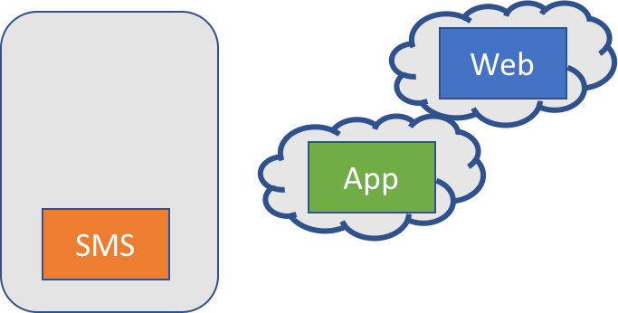

# Lab Step 2



Refactor API into a Docker container

* Web Service already refactored to container 
* SMS Service continues to run in VM

# Steps 

## Vagrantfile Updates 

1. Destroy current Vagrant box 

    ```bash
    vagrant destroy
    ```

1. Don't map the API Port
    * Delete/Comment ~line 27
    
        ```
        config.vm.network "forwarded_port", guest: 5000, host: 15000
        ```

1. Don't create the Python 3.5 virtual env

    * Delete/Comment ~line 88
    
        ```
        virtualenv /home/vagrant/venv_haciendo --python=python3.5
        ```

1. Don't Prep the Python 3.5 virtual env

    * Delete/Comment ~line 106
    
        ```
        # Prep the Virtual Env for API and Web
        source /home/vagrant/venv_haciendo/bin/activate
        pip install -r /vagrant/requirements.txt        
        ```

1. Don't start the API Service
    * Delete/Comment ~line 111
        
        ```bash
        # Start the API Service
        cd /vagrant/api
        nohup python haciendo_api.py -p 5000 -t http://localhost:5001/score -y ${YANDEX_KEY} > api_log.log 2>&1 &
        ```
        
1. Update comments/docs at end
    * Delete/Comment ~line 124
    
        ```bash
        echo "API running on http://localhost:15000 "
        ```

1. Start new VM with just Web and SMS running
        
    ```bash
    vagrant up 
    ```            
        
1. Leave Vagrant VM up and running
         
## Docker File Creation 

1. Create new empty file called `Dockerfile` within the `./api` directory 

    ```bash
    cd api
    touch Dockerfile
    ```

1. Boilerplate python/3.5-alpine Dockerfile 

    ```
    FROM python:3.5-alpine
    
    # Install basic utilities
    RUN apk add -U \
            ca-certificates \
      && rm -rf /var/cache/apk/* \
      && pip install --no-cache-dir \
              setuptools \
              wheel    
    ```
    
1. Add api code and port details
  
    ```
    FROM python:3.5-alpine
    EXPOSE 5000
    
    # Install basic utilities
    RUN apk add -U \
            ca-certificates \
      && rm -rf /var/cache/apk/* \
      && pip install --no-cache-dir \
              setuptools \
              wheel   
              
    # Create application directories
    RUN mkdir /app          
    
    # Prep Required Environment Variables
    # These are default placeholders but should be overridden
    # when running the container
    ENV SMS_SERVER="http://localhost:5001"
    ENV YANDEX_KEY="YOUR_KEY"
    
    # Copy needed application requirements file into image
    ADD requirements.txt /app
    
    # Install Python requirements
    RUN pip install -r /app/requirements.txt
    
    # Copy application code into image
    ADD haciendo_api.py /app    
    ```
    
1. Add CMD to start Haciendo
    
    ```
    FROM python:3.5-alpine
    EXPOSE 5000
    
    # Install basic utilities
    RUN apk add -U \
            ca-certificates \
      && rm -rf /var/cache/apk/* \
      && pip install --no-cache-dir \
              setuptools \
              wheel   
              
    # Create application directories
    RUN mkdir /app          
    
    # Prep Required Environment Variables
    # These are default placeholders but should be overridden
    # when running the container
    ENV SMS_SERVER="http://localhost:5001"
    ENV YANDEX_KEY="YOUR_KEY"
    
    # Copy needed application requirements file into image
    ADD requirements.txt /app
    
    # Install Python requirements
    RUN pip install -r /app/requirements.txt
    
    # Copy application code into image
    ADD haciendo_api.py /app 
    
    # Run the application
    CMD cd /app && python haciendo_api.py -p 5000 -t ${SMS_SERVER}/score -y ${YANDEX_KEY}         
    ```        

## Build Docker image

1. Build the image

    ```
    cd api
    docker build -t haciendo_api . 
    ```

## Run Docker image

1. Determine your local workstation's IP address.  
    * Needed to provide the address for the SMS server to the API Container
    * Can't use "localhost" because within the container, "localhost" means the container, not your workstation
    
    ```
    # Most Macs use en0 for Wifi, yours might be different
    ifconfig en0
    ```
    
    * Remember this IP for the next command
    
1. Run API container in interactive mode to view the startup and logs
    * Insert your workstation IP address into the command below
    * Insert your Yandex Key into the command below

    ```
    docker run -it \
      --env SMS_SERVER=http://<YOUR IP ADDRESS>:15001 \
      --env YANDEX_KEY="YOUR_KEY" \
      -p 15000:5000 \
      haciendo_api 
    ```

1.  Test the containerized API Service

    ```bash
    curl -X POST <YOUR IP ADDRESS>:15000/api/score \
      -d 'line=hello' \
      -d 'phonenumber=55555555555'
    ```

1. Open another terminal window and run WEB container in interactive mode to view the startup and logs
    * Insert your workstation IP address into the command below

    ```
    docker run -it --env API_SERVER=http://<YOUR IP ADDRESS>:15000 -p 15080:80 haciendo_web 
    ```
        
1. Access the new containerized version of the Web Interface by opening `http://<YOUR IP ADDRESS>:15080` in a browser

1. Send a message to test that all is working

